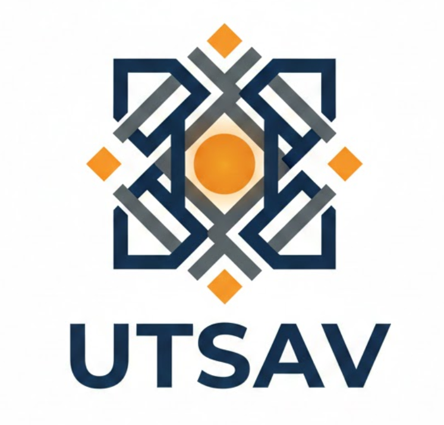
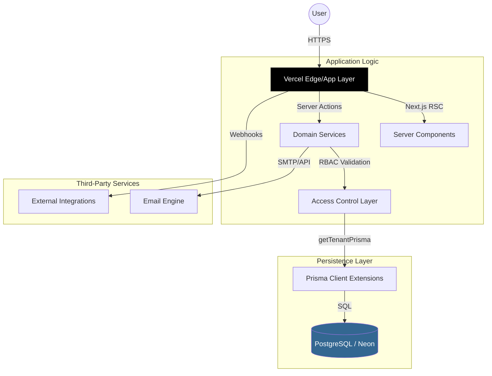
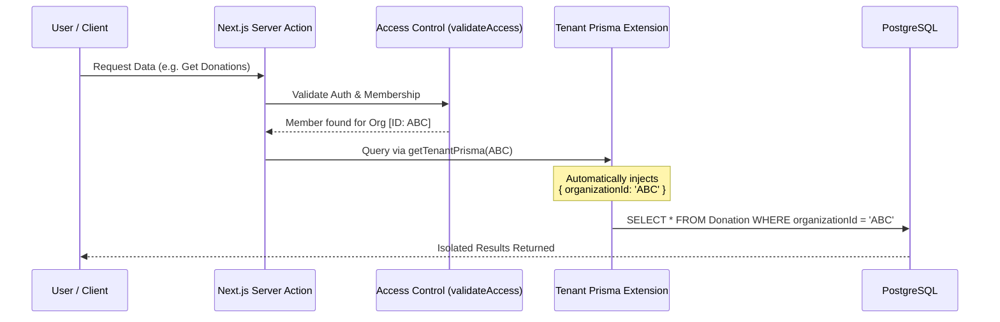

<div align="center">
  
  <h1>🏛️ UTSAV</h1>
  <p><strong>Organization Governance & Pavilion Intelligence</strong></p>
</div>

[](https://nextjs.org/)
[](https://www.typescriptlang.org/)
[](https://www.prisma.io/)
[](https://tailwindcss.com/)
[](./LICENSE)

**UTSAV** is a production-grade, multi-tenant governance platform designed to digitize the operations of large-scale cultural organizations and festivals. It replaces chaotic manual ledgers and messaging groups with a high-integrity, digital twin of the organization.

Originally conceived as a *Festival Management System*, UTSAV has evolved into a comprehensive **Organization Governance Platform**, capable of managing multiple events, hundreds of members, and complex financial engines with strict data isolation.

---

## ✨ Key Features

###  Multi-Tenant Security & Isolation
Built from the ground up for scale, UTSAV uses a robust multi-tenant architecture.
- **Virtual Pavilions:** Create and manage diverse organizations (Festivals, Clubs, Committees).
- **Hard Limits & Governance:** Enforced limit of 10 organizations per user to maintain ecosystem integrity.
- **Organization Deletion:** Full control over the lifecycle with a secure "Danger Zone" for permanent organization deletion.
- **Architectural Isolation:** Custom Prisma Extensions (`getTenantPrisma`) ensure data never leaks between organizations.
- **Role-Based Access Control (RBAC):** Granular permissions for Admins, Treasurers, Members, and Volunteers.

###  High-Integrity Financial Engine
A "Zero-Trust" financial system designed for radical transparency.
- **Double-Entry Operations:** Every expense and donation is tracked with atomic precision.
- **Approval Workflows:** Expenses require digital sign-off before impacting the ledger.
- **Real-time Analytics:** Dashboard aggregations for target vs. utilized funds.

### Intelligent Event Governance
- **Lifecycle Management:** Plan, Activate, and Archive events.
- **Soft-Delete Architecture:** Historical data (attendees, finances) is preserved even after event deletion for audit purposes.
- **Smart Rostering:** Automated team assignments that filter out archived or suspended members.

- **Shielded Invitations:** High-security, token-based system with strict email matching to prevent account hijacking.
- **Omnichannel Sharing:** Generate instant invitation links for direct sharing via WhatsApp or personal messaging.
- **Instant Onboarding:** Ability to skip automated emails for faster, link-based member onboarding.
- **Profile Centricity:** Members maintain a unified identity across multiple organizations while preserving role-specific data.

---

---

## 🏛️ System Architecture

UTSAV is built on a **Modular Monolith** architecture using Next.js 14, prioritizing type-safety, tenant isolation, and atomic state management.

### 🧩 High-Level Design


---

## 🏗️ Deep System Design Pillars

### 1. Logical Multi-Tenancy (Row-Level Isolation)
Instead of expensive physical database-per-tenant isolation, UTSAV utilizes **Logical Isolation** via a custom Prisma Extension.
- **The Context Pattern**: Every request is wrapped in an `organizationId` context.
- **getTenantPrisma**: We extended the Prisma client to automatically inject `WHERE organizationId = X` filters into every query. This ensures that even a developer error cannot leak data between "Pavilions" (Organizations).

#### 🛡️ Tenant Isolation Flow


### 2. High-Integrity Financial Engine
To prevent data corruption during simultaneous donations or expenses, UTSAV implements:
- **Atomic Transactions**: All financial operations use `prisma.$transaction`. If a donation record fails, the running balance never updates—ensuring "all-or-nothing" consistency.
- **State Immutability**: Critical records are never truly deleted; they are "Archived" to maintain an unbroken audit trail for year-end transparency reports.

### 3. Granular RBAC (Role-Based Access Control)
Access is enforced at the **Service Layer**, not just the UI level.
| Role | Access Level | Responsibilities |
| :--- | :--- | :--- |
| **Admin** | Superuser | Governance, Deletion, Role Management |
| **Treasurer** | Financial | Expense Approvals, Audit Logs, Income Entry |
| **Committee** | Operational | Task Delegation, Event Orchestration |
| **Volunteer** | Execution | Task Updates, Attendee Management |

### 4. Soft-Delete & Audit Archiving
The system implements a standardized `isArchived` pattern across all models. 
- **Preserved History**: Deleting an event doesn't scrub its financial footprint; it moves it to a "Historical" state, allowing the organization to look back at past years' performance without cluttering the active dashboard.

---

---

## 📸 Interface Preview

<!-- [PLACEHOLDER: Dashboard Screenshot] -->
<!-- Caption: The Command Center showing real-time financial stats and active events. -->

<!-- [PLACEHOLDER: Financial Table Screenshot] -->
<!-- Caption: Granular expense tracking with approval status indicators. -->

<!-- [PLACEHOLDER: Member Management Screenshot] -->
<!-- Caption: Role management and invitation status board. -->

---

## Getting Started

### Prerequisites
- Node.js 18+
- PostgreSQL Database (Local or Neon/Supabase)

### Installation

1. **Clone the repository**
   ```bash
   git clone https://github.com/coderved63/UTSAV_Management_Platform.git
   cd UTSAV_Management_Platform
   ```

2. **Install dependencies**
   ```bash
   npm install
   ```

3. **Configure Environment**
   Duplicate `.env.example` to `.env` and fill in your secrets.
   ```bash
   cp .env.example .env
   ```
   *Note: Ensure `NEXTAUTH_URL` is set to `http://localhost:3000` for local development.*

4. **Initialize Database**
   ```bash
   npx prisma generate
   npx prisma db push
   ```

5. **Run Development Server**
   ```bash
   npm run dev
   ```

---

## � Project Structure

```bash
src/
├── actions/        # Server Actions (Mutations)
├── app/            # Next.js App Router Pages
├── components/     # Shadcn UI & Custom Components
│   ├── dashboard/  # Feature-specific widgets
│   ├── layout/     # Shell, Sidebar, Navbar
│   └── ui/         # Primitives (Buttons, Cards)
├── lib/            # Utilities (Auth, Email, Prisma)
├── modules/        # Business Logic Domain Services
│   ├── core/       # Org, Member, Invitation Logic
│   ├── festival/   # Event & Financial Logic
│   └── public/     # Public-facing interactions
└── types/          # TypeScript Definitions
```

---

## 🛡️ Security & Privacy

- **Authentication:** Powered by `next-auth` with secure session handling.
- **Safety:** Stale sessions are automatically invalidated.
- **Data Protection:** All organization data is logically isolated via tenant IDs.

---

## 🤝 Contributing

We welcome contributions! Please see our [CONTRIBUTING.md](CONTRIBUTING.md) for details.

1. Fork the Project
2. Create your Feature Branch (`git checkout -b feature/AmazingFeature`)
3. Commit your Changes (`git commit -m 'feat: Add some AmazingFeature'`)
4. Push to the Branch (`git push origin feature/AmazingFeature`)
5. Open a Pull Request

---

## 📄 License

Distributed under the MIT License. See `LICENSE` for more information.

---

*Built with ❤️ by Vedant Mehta*
